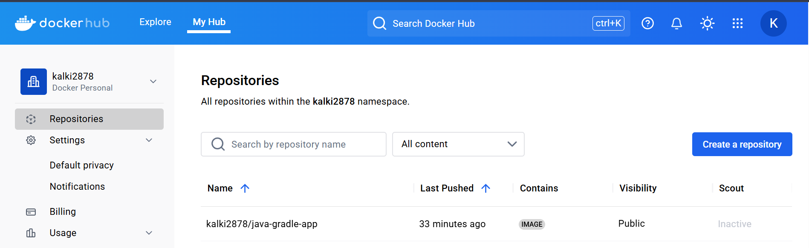

# Java Gradle Project

This project is a simple Spring Boot web application built using Gradle. It demonstrates how to compile a Java application and publish the generated JAR artifact to a Maven repository (Nexus) using the Maven Publishing plugin.

## Table of Contents

- [Overview](#overview)
- [Features](#features)
- [Prerequisites](#prerequisites)
- [Getting Started](#getting-started)
- [Build and Run](#build-and-run)
- [Publishing the Artifact](#publishing-the-artifact)
- [Gradle Configuration Details](#gradle-configuration-details)
- [Troubleshooting](#troubleshooting)
- [Docker Integration (Part-2)](#docker-integration-part-2)
- [CI/CD Pipeline (Part-3)](#cicd-pipeline-part-3)
- [Jenkins Shared Library Setup and Basic Usage (Part-4)](#jenkins-shared-library-setup-and-basic-usage-part-4)

## Overview

This Java project leverages Spring Boot to build a web application. In addition to running the application, it includes a custom Gradle configuration for publishing the JAR artifact to a Nexus repository. The project demonstrates:
- Secure publishing configuration via `gradle.properties`
- Allowing an insecure (HTTP) protocol in controlled environments

## Features

- **Maven Publishing:** Publishes snapshots to a Nexus repository.
- **Gradle Build Automation:** Automated build and publish processes.

## Prerequisites

- **Java Development Kit (JDK):** JDK 17 (or higher) must be installed.
- **Gradle Wrapper:** The project includes a Gradle wrapper; no separate installation is required.
- **Nexus Repository:** A Nexus instance (or any Maven repository) running at `http://localhost:8081/repository/maven-snapshots/` (update URL as needed).

## Getting Started

1. **Clone the Repository:**
   ```sh
   git clone <repository-url>
   cd java-gradle-project
   ```
2. **Configure Repository Credentials:**
   Create or update the `gradle.properties` file in the project root with:
   ```properties
   repoUser=your-username
   repoPassword=your-password
   ```

## Build and Run

Build the project using the Gradle wrapper:
```sh
./gradlew build
```
Run the Spring Boot application:
```sh
./gradlew bootRun
```
The compiled JAR file is located in the `build/libs/` directory.

## Publishing the Artifact

1. **Ensure your Nexus repository is running.**
2. **Publish the Artifact:**
   ```sh
   ./gradlew publish
   ```
This command publishes the artifact (`java-gradle-project-1.0-SNAPSHOT.jar`) to the configured Nexus repository.

### Note on Insecure Protocol

Since the Nexus repository URL uses HTTP (`http://localhost:8081`), which is insecure, add the following to your Gradle configuration:
```groovy
allowInsecureProtocol = true
```

## Gradle Configuration Details

- **Plugins Used:**
  - `maven-publish` – Publishes artifacts to a Maven repository.
- **Artifact Configuration:**
  ```groovy
  artifact(file("build/libs/java-gradle-project-${version}.jar")) {
      extension = 'jar'
  }
  ```

## Troubleshooting

- **Error: "No such property: jar for class: java.lang.String"**  
  Verify the string interpolation is correctly formatted:
  ```groovy
  "build/libs/java-gradle-project-${version}.jar"
  ```
- **Insecure Protocol Issues:**  
  Ensure `allowInsecureProtocol = true` is set in the Gradle configuration.

## Proof of Nexus Repository

Below is a screenshot showing the Nexus repository after a successful publish:


## Docker Integration (Part-2)

This section expands the project by creating a Docker image and pushing it to the Nexus Repository Manager using the previously generated `.jar` file.

1. **Docker Login to Nexus Repository:**
   ```sh
   docker login <nexus-server-ip>:<docker-repository-port>
   ```
   Replace `<nexus-server-ip>` and `<docker-repository-port>` with your Nexus server details. You will be prompted for your Nexus username and password.
2. **Docker Authentication and Config.json:**
   Upon login, Docker stores an authentication token in:
   - **Linux/macOS:** `~/.docker/config.json`
3. **Pushing a Docker Image to Nexus:**
   - **Build a Docker Image:**
     ```sh
     docker build -t <image-name>:<tag> .
     ```
   - **Tag the Image for Nexus Registry:**
     ```sh
     docker tag <local-image-name>:<local-tag> <nexus-registry-endpoint>/<image-name>:<tag>
     ```
   - **Push the Retagged Image:**
     ```sh
     docker push <nexus-registry-endpoint>/<image-name>:<tag>
     ```
4. **Verifying the Pushed Image:**
   Check the image in your Nexus Docker Hosted repository via the Nexus UI.
5. **Retrieving Docker Image Information:**
   ```sh
   curl -u <nexus-username>:<nexus-password> -X GET 'http://<nexus-server-ip>:8081/service/rest/v1/components?repository=<docker-repository-name>'
   ```
   Replace placeholders as needed.
6. **Proof of Nexus Docker Image:**
   

## CI/CD Pipeline (Part-3)

This section outlines the CI/CD process for the project. The Jenkins pipeline loads an external script (`script.groovy`) which defines methods for:
- **Building the JAR:** Compiles the project and creates the JAR file.
- **Building a Docker Image:** Uses the JAR to build a Docker image.
- **Deploying the Application:** Deploys the application based on the defined strategy.

Additionally, the pipeline automates the upload of the Docker image to a private Docker Hub repository. Below is a screenshot showing proof of the Docker image upload from the CI/CD pipeline:


## Jenkins Shared Library Setup and Basic Usage (Part-4)

As part of implementing the Shared Library, the following functions were created in the `vars/` directory to encapsulate build logic:

### `vars/buildImage.groovy`
This function builds and pushes a Docker image to Docker Hub.
```groovy
#!/usr/bin/env groovy

def call(String imageName) {
    echo 'Building the docker image'
    withCredentials([usernamePassword(credentialsId: 'docker-hub-credentials', passwordVariable: 'DOCKER_PASSWORD', usernameVariable: 'DOCKER_USERNAME')]) {
        sh "docker build -t ${imageName} ."
        sh "echo ${DOCKER_PASSWORD} | docker login -u ${DOCKER_USERNAME} --password-stdin"
        sh "docker push ${imageName}"
    }
}
```
**Explanation:**  
- Accepts an `imageName` parameter to specify the Docker image name and tag.
- Uses `withCredentials` to securely access Docker Hub credentials.
- Executes shell commands to build the Docker image, log in to Docker Hub, and push the image.

### `vars/buildJar.groovy`
This function builds the Java application using Gradle.
```groovy
#!/usr/bin/env groovy

def call() {
    echo "Building the application for branch $BRANCH_NAME"
    sh "./gradlew build"
}
```
**Explanation:**  
- No parameters are needed.
- Prints a message indicating the branch being built.
- Executes the Gradle build command to compile the application and create the JAR file.

### Jenkinsfile Using Shared Library Functions
```groovy
@Library('devops-shared-lib@feature_branch') _
pipeline {
    agent any
    stages {
        stage("build jar") {
            steps {
                script {
                    buildJar() // Build the JAR file using the shared library function.
                }
            }
        }
        stage("build image") {
            steps {
                script {
                    buildImage("kalki2878/java-gradle-app:latest") // Build the Docker image using the shared library function.
                }
            }
        }
    }
}
```
**Explanation:**  
- The `@Library` annotation loads the shared library from the specified branch (`feature_branch`).
- The pipeline includes two stages:
  - **build jar:** Calls `buildJar()` to compile the Java application.
  - **build image:** Calls `buildImage()` with the Docker image name to build and push the Docker image.
- This setup allows centralized management of build logic via the shared library.
