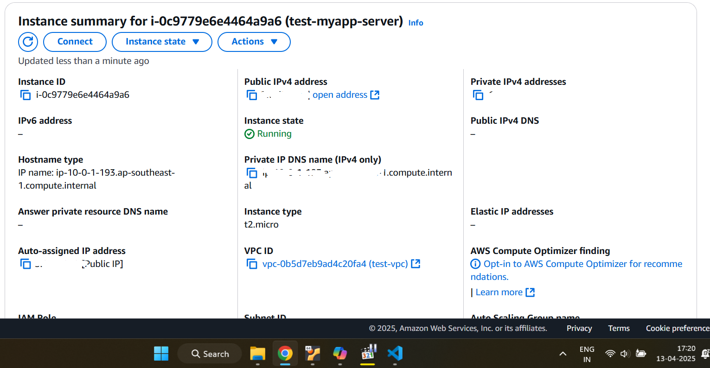
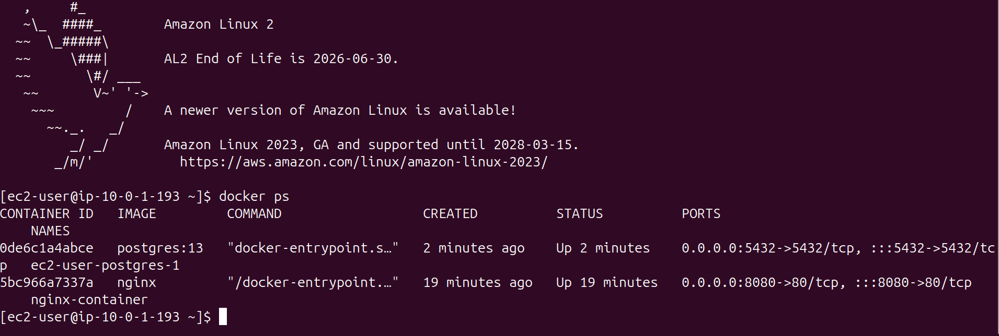

# CI/CD Pipeline with Jenkins, Terraform, and Docker Compose for Java Application on AWS

This project demonstrates a complete end-to-end CI/CD pipeline orchestrating the build, infrastructure provisioning, and deployment of a containerized Java application with a PostgreSQL database onto an AWS EC2 instance.

**Core Technologies:** Jenkins (Pipeline & Shared Library), Terraform (IaC), Docker, Docker Compose, AWS (EC2, VPC, SG), Gradle, Groovy, Shell Scripting.

## Proof of Execution (Screenshots)

*(Screenshots demonstrating the successful execution of the Jenkins pipeline and the resulting deployment.)*

**1. AWS EC2 Instance Created by Terraform:**

*Description: This screenshot shows the AWS Management Console view of the EC2 instance successfully provisioned by the Terraform stage in the Jenkins pipeline (e.g., `test-myapp-server`), confirming its running state and public IP address.*

**2. Application Containers Running on EC2:**

*Description: This screenshot shows the output of `sudo docker ps` executed on the provisioned EC2 instance, listing the running `java-maven-app` (using the `kalki2878/java-gradle-app` image) and `postgres` containers managed by Docker Compose.*

---

## Overview

This project integrates several DevOps tools to automate the following workflow:

1.  **CI (Jenkins):**
    * Builds a Java application using Gradle (via a Jenkins Shared Library).
    * Builds a Docker image for the application and pushes it to Docker Hub (via a Jenkins Shared Library).
2.  **IaC (Terraform via Jenkins):**
    * Provisions the necessary AWS infrastructure (VPC, Public Subnet, Security Group, EC2 instance) using Terraform executed from a Jenkins stage.
    * The EC2 instance is bootstrapped using `user_data` to install Docker and Docker Compose.
3.  **CD (Jenkins & Docker Compose):**
    * Jenkins copies the `docker-compose.yml` and a deployment script (`server-cmds.sh`) to the newly provisioned EC2 instance.
    * Jenkins remotely executes the deployment script on the EC2 instance via SSH.
    * The script logs into Docker Hub and uses `docker-compose up` to pull the application and database images and run the application stack.

---

## Prerequisites

Before running this pipeline, ensure the following are set up:

1.  **Jenkins Server:** A running Jenkins instance.
2.  **Jenkins Plugins:**
    * SSH Agent
3.  **Jenkins Global Tool Configuration:**
    * **Gradle:** A Gradle installation configured with the name `Gradle 7.6.1`.
4.  **Jenkins Agent Configuration:**
    * The Jenkins agent (`agent any`) must have Git, Docker CLI, Terraform CLI, and potentially `scp`/`ssh` clients installed.
    * Network connectivity to GitHub, Docker Hub, and AWS services.
5.  **Source Code Repository:** The project code containing:
    * Java/Gradle application source.
    * `Dockerfile` for the Java application.
    * `Jenkinsfile`.
    * `docker-compose.yml`.
    * `server-cmds.sh`.
    * `terraform/` directory with `.tf` files and `entry-script.sh`.
6.  **Jenkins Shared Library:**
    * Access for Jenkins to clone the repository `https://github.com/TheSudheer/Jenkins-shared-library.git`.
7.  **AWS Account:**
    * An active AWS account.
    * **IAM Permissions:** AWS credentials used by Jenkins require permissions to manage VPC, Subnet, EC2, Security Group, IGW, Route Tables, and Key Pairs.
    * **SSH Key Pair:** An SSH key pair named `new-ssh` must exist in the target AWS region specified in `terraform/variables.tf` (`ap-southeast-1` by default). The corresponding private key is needed for Jenkins.
8.  **Docker Hub Account:** An account to push/pull the Java application image.
9.  **Jenkins Credentials:** Configure the following credentials in Jenkins:
    * `GitHub`: Credential (likely SSH key or username/PAT) for cloning the Shared Library repository.
    * `jenkins_aws_access_key_id`: Jenkins Secret text credential containing the AWS Access Key ID.
    * `jenkins_aws_secret_access_key`: Jenkins Secret text credential containing the AWS Secret Access Key.
    * `docker-hub-credentials`: Jenkins Username/Password credential containing your Docker Hub username and password/PAT.
    * `ec2-server-key`: Jenkins SSH Username with private key credential containing the private key corresponding to the `new-ssh` key pair in AWS (use `ec2-user` as the username).

---

## Project Components Breakdown

1.  **`Jenkinsfile`:**
    * Orchestrates the entire CI/CD process.
    * Uses `devops-shared-lib` for common tasks (`buildJar`, `buildImage`).
    * **`build jar` Stage:** Compiles the Java/Gradle application.
    * **`build image` Stage:** Builds the application's Docker image and pushes it to Docker Hub (`kalki2878/java-gradle-app:latest`).
    * **`Provision Server` Stage:** Executes `terraform init` and `terraform apply` within the `terraform/` directory, injecting AWS credentials. Captures the public IP of the created EC2 instance.
    * **`Deploy` Stage:** Uses `sshagent` with the `ec2-server-key` to connect to the provisioned EC2 instance. Copies `docker-compose.yml` and `server-cmds.sh` using `scp`. Executes `server-cmds.sh` remotely via `ssh`, passing image name and Docker Hub credentials.

2.  **`terraform/` Directory:**
    * **`main.tf`:** Defines AWS resources (VPC, Subnet, IGW, Route Table, Security Group, EC2 Instance). Configures the EC2 instance to use `user_data`.
    * **`variables.tf`:** Declares variables (with defaults) for AWS region, CIDR blocks, instance type, etc.
    * **`entry-script.sh`:** Executed via EC2 `user_data` on boot. Installs Docker and Docker Compose. *Note: It also unnecessarily attempts to run an Nginx container, which is ignored/overwritten by the later Docker Compose deployment.*
    * **Security Group:** Allows SSH (22) and application traffic (8080) based on `var.my_ip` (defaults to `0.0.0.0/0` - anywhere). Allows limited egress (defaults to `0.0.0.0/0` - *Correction: SG egress rule in `main.tf` incorrectly uses `var.my_ip`. It should typically be `0.0.0.0/0` for internet access*).
    * **EC2 Instance:** Uses the latest Amazon Linux 2 AMI and the `new-ssh` key pair.

3.  **`docker-compose.yml`:**
    * Defines the application stack for deployment.
    * `java-maven-app` service: Runs the Java application container using the image built by Jenkins (passed via `IMAGE` variable). Maps host port 8080 to container port 8080. *Note the service name mismatch (maven vs. gradle).*
    * `postgres` service: Runs a standard PostgreSQL 13 database container. Maps port 5432 and sets a password.

4.  **`server-cmds.sh`:**
    * This script is executed on the EC2 instance during the Jenkins `Deploy` stage.
    * Receives the application image name, Docker Hub username, and password as arguments.
    * Logs into Docker Hub using the provided credentials.
    * Starts the services defined in `docker-compose.yml` in detached mode (`docker-compose up -d`).

---

## How to Run

1.  Ensure all prerequisites are met (AWS setup, Jenkins config, credentials, source code available to Jenkins).
2.  Create a new **Pipeline** job in Jenkins.
3.  Configure the job:
    * Point it to the SCM repository containing your project code (including `Jenkinsfile`).
    * Specify the correct branch.
    * Ensure the "Script Path" is `Jenkinsfile`.
4.  Save the Jenkins job configuration.
5.  Manually trigger the Jenkins build ("Build Now").
6.  Observe the pipeline execution through the Jenkins UI. Check the logs for each stage, especially Terraform apply and the remote SSH/SCP commands in the Deploy stage.
7.  Once successful, access the application via `http://<EC2_PUBLIC_IP>:8080`.

---

## Key Configurations

* **Terraform Variables:** Defaults are set in `terraform/variables.tf`. You can override them using `TF_VAR_variable_name` environment variables in the Jenkins `Provision Server` stage if needed, or by creating a `.tfvars` file (though the pipeline currently doesn't use one).
* **Jenkins Credentials:** Ensure all required credential IDs match exactly between the `Jenkinsfile` and Jenkins configuration.
* **AWS Key Pair:** The name `new-ssh` is hardcoded in `terraform/main.tf`. Ensure this key exists in AWS or update the Terraform code.
* **Docker Image Name:** Hardcoded as `kalki2878/java-gradle-app:latest` in the `Jenkinsfile`. Modify if needed.
* **Ports:** The application runs on port 8080 (EC2) and the database on 5432 (EC2). Security groups must allow access.

---
This project effectively integrates key DevOps practices (CI/CD, IaC, Containerization) to automate the deployment lifecycle of a typical web application stack onto AWS.
